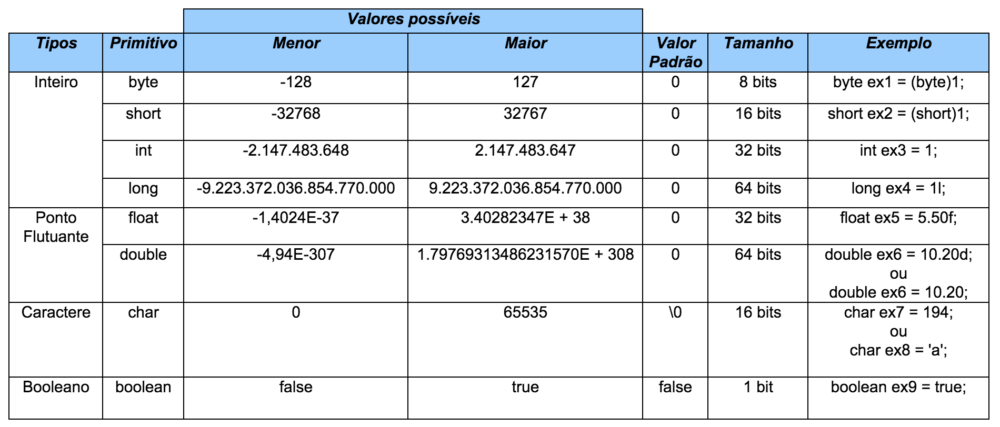

# Java - Tipos Primitivos

Os tipos primitivos são tipos de dados pré-definidos que ocupam um espaço específico em memória para armazenar o conteúdo. Os tipos de dados/variáveis primitivas no Java são 8:

 \* Correção: boolean tem o tamanho de 8 bits, pois o tamanho mínimo em java é 1 byte

## Projeto

Para este pequeno projeto, foram utlizadas pelo menos um de cada tipo primitivo nas variáveis. Para atingirmos nosso objetivo de 600 bits (75 bytes), foram tais variáveis:

- 2 do tipo byte
- 1 do tipo short
- 1 do tipo int
- 1 do tipo long
- 1 do tipo float
- 1 do tipo double
- 1 do char[23] (vetor de tamanho 23)
- 1 do tipo boolean

Com isso totalizamos exatamente 600 bits (75 bytes).

Criamos um objeto com esta classe e imprimimos todo o conteúdo de forma simples para demonstração.

---

Alunos: `Jordan` & `Endrew`

Fonte: [Universidade Java](http://www.universidadejava.com.br/materiais/java-tipos-primitivos/)
